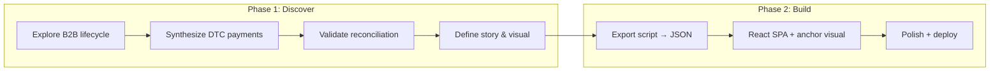

# feat: Build Contract-to-Cash revenue lifecycle portfolio piece

## Summary

Implementation approaches the work in two phases: discovery (explore platform data, synthesize missing DTC payment lifecycle, find the story) then a vertical build (export script → JSON → React SPA → deploy). B2B lifecycle uses fct_payments gross-to-net as the frame; DTC lifecycle requires new synthetic Shopify payment data. Charting library and visual approach are explicitly deferred to post-exploration.

---

## Problem Frame

The Cinderhaven Data Platform has the data to tell a full revenue lifecycle story but no buyer-facing piece currently does so. Retailer-deduction-recovery covers one stage (deductions); short-ship-cost covers another (fulfillment losses). Neither answers: "What did we actually net?" C2C fills that gap.

(see origin: `docs/brainstorms/2026-05-16-revenue-lifecycle-requirements.md`)

---

## Requirements

- R1. Complete revenue lifecycle story — gross through net cash, every material leakage stage
- R2. Economist-style provocative headline, immediate differentiation from RDR
- R3. Three reactions in sequence: total gap shock, blind-spot discovery, retailer comparison
- R4. Economist voice throughout
- R5. All figures reconcile with Cinderhaven canonical numbers
- R6. New synthetic data (DTC payments) additive and consistent with existing projects
- R7. Every claim traceable to a verifiable query
- R8. One anchor visual delivers the headline's promise in a single look
- R9. Economist chart style: minimal, text-labeled, no decoration
- R10. Narrative, not dashboard
- R11. Supporting detail subordinate to anchor visual
- R12. React SPA (Vite), Cloudflare Pages
- R13. Static JSON via Python export script
- R14. Lailara Design System tokens
- R15. Narrative/visual approach determined by data exploration
- R16. Exploration must answer: lifecycle stages available, total gross-to-net gap, largest leakage points, retailer variation

**Origin actors:** A1 (CFO, primary viewer), A2 (CEO, secondary viewer), A3 (Portfolio visitor, discovery)
**Origin acceptance examples:** AE1 (covers R1, R3, R8 — CFO grasps story in 10s), AE2 (covers R5, R7 — deduction total matches RDR), AE3 (covers R2, R10 — immediately distinct from RDR)

---

## Scope Boundaries

### Deferred for later

- Specific headline text (exploration output)
- Specific chart type (exploration output)
- Single-view vs. multi-section structure (exploration output)
- Interaction patterns beyond the anchor
- LinkedIn/marketing content

### Outside this product's identity

- Dashboard-style filtering and exploration
- DE proof or technical showcase
- Jupyter notebook as separate deliverable
- Streamlit or server-rendered application
- Extending platform beyond what the story requires (except DTC payment synthesis)

### Deferred to Follow-Up Work

- Additional portfolio cross-linking (compounds with other pieces — separate effort)

---

## Context & Research

### Relevant Code and Patterns

- `retailer-deduction-recovery/scripts/20_export_json.py` — Python export pattern: queries Postgres, builds denormalized JSON, writes to `frontend/public/json/`
- `retailer-deduction-recovery/scripts/21_validate_dataset.py` — 36-check validation suite with referential integrity, row count, and dollar volume checks
- `retailer-deduction-recovery/frontend/src/` — React + TypeScript + Vite + D3 Sankey SPA pattern
- `short-ship-cost/web/src/` — React + Vite + Recharts SPA pattern (alternative charting approach)
- `cinderhaven-data-platform/cinderhaven/models/marts/` — dbt marts consumed by this project
- `cinderhaven-data-platform/scripts/generate_shopify_orders.py` — existing DTC order generation (10K orders)

### Platform Data: Join Paths

```
fct_orders.order_id (B2B, grain: line item)
  → fct_shipments.order_id (1:1 per order)
    → fct_deductions.order_id OR .shipment_id (1:many, nullable)
      → fct_payments.remittance_id (many:1, via deduction.remittance_id)
```

Key columns for gross-to-net:
- `fct_orders.line_total` — gross invoiced per line
- `fct_deductions.deduction_amount` — amount deducted (9 types)
- `fct_deductions.net_recovery` — recovered via dispute
- `fct_payments.gross_amount` / `.net_amount` — remittance-level totals

### Reconciliation Surface (Canonical Numbers)

| Metric | Value | Source Project |
|--------|-------|---------------|
| Total deductions | 3,087 at $1,537,390.70 | retailer-deduction-recovery |
| Disputes filed/recovered | 1,410 / $98,215.54 | retailer-deduction-recovery |
| B2B orders / shipments | 5,838 at $31,409,072.52 (1:1 order-to-shipment) | retailer-deduction-recovery |
| POS revenue (52-wk trailing) | ~$25.6M | trade-spend-data-diagnostic |
| Deduction types | 9 (exact breakdown in RDR summary.json) | retailer-deduction-recovery |
| Retailers | 10 B2B retailers + DTC (Shopify) = 11 channels total | All projects |
| SKUs | 90 | All projects |

### Time Window

All transactional data spans December 2024 – May 2026 (18 months). POS scan data extends back to May 2024 (104 weeks).

---

## Key Technical Decisions

- **B2B revenue frame is fct_payments.gross_amount**: The lifecycle view shows what retailers owed (gross) minus deductions = net received. This is the true "contract to cash" path. fct_orders.line_total is the invoice measure; POS is sell-through. All are legitimate but C2C uses the payment frame.
- **DTC included via Shopify payment synthesis**: Both channels shown to tell the complete story. DTC leakage (fees, refunds, chargebacks) is different from B2B (retailer deductions) — the comparison itself is insightful.
- **No new dbt models unless exploration reveals a critical gap**: Export script SQL handles analytical aggregations. If a calculation is too complex or reusable, it escalates to a platform model.
- **Charting library deferred**: D3 if the anchor is a Sankey or custom visualization; Recharts if it's a standard waterfall/bar. Decision made after exploration.

---

## Open Questions

### Resolved During Planning

- **What lifecycle stages exist in the data?** Orders → shipments → deductions → payments (B2B). DTC has orders only — payments to be synthesized.
- **Can you calculate gross-to-net?** Yes. fct_payments has gross_amount and net_amount per remittance. fct_deductions breaks down the difference by type.
- **What's the join path?** order_id → shipment_id → deduction (nullable) → remittance_id → payment. Not every order has deductions; remittances bundle multiple orders.
- **What about DTC?** Platform has 10K DTC orders but no payment lifecycle. Need to synthesize Shopify fees, refunds, chargebacks, and payouts.

### Deferred to Implementation

- **Exact gross-to-net totals and starting point**: SUM(fct_payments.gross_amount) will differ from SUM(fct_orders.line_total) — orders near window-end may lack remittances. Exploration determines which top-line figure tells the better story (and whether AR/unreceived is itself part of the narrative)
- **Whether shipment-stage leakage is material**: Short-ships, late deliveries, OTIF fines — the data has these signals but materiality is unknown until queried
- **Optimal JSON granularity**: Depends on what the visual needs (aggregate summary vs. per-retailer vs. per-order)
- **DTC payment rates**: Exact Shopify fee structure, refund rates, and chargeback frequency to use in synthesis

---

## Output Structure

```
contract-to-cash/
├── scripts/
│   ├── explore_lifecycle.py        # Phase 1: exploration queries
│   ├── generate_dtc_payments.py    # Phase 1: DTC payment synthesis
│   ├── export_json.py              # Phase 2: production export
│   └── validate_cross_project.py   # Phase 2: reconciliation checks
├── frontend/
│   ├── index.html
│   ├── package.json
│   ├── tsconfig.json
│   ├── vite.config.ts
│   ├── wrangler.toml
│   └── src/
│       ├── main.tsx
│       ├── App.tsx
│       ├── data.ts
│       ├── types.ts
│       └── components/
│           └── [determined by exploration]
│   └── public/
│       └── json/
│           └── [schema determined by exploration]
├── docs/
│   ├── brainstorms/
│   └── plans/
└── [project state files]
```

---

## High-Level Technical Design

> *This illustrates the intended approach and is directional guidance for review, not implementation specification.*



**Data flow (production):**
```
Postgres (platform marts + DTC payment tables)
    ↓ scripts/export_json.py
Static JSON (frontend/public/json/)
    ↓ Vite build
Cloudflare Pages (deployed SPA)
```

---

## Implementation Units

### U1. Explore B2B revenue lifecycle

**Goal:** Query the platform to calculate the full B2B gross-to-net waterfall, identify leakage by stage and retailer, and determine whether the data tells a dramatic story.

**Requirements:** R1, R15, R16

**Dependencies:** None (platform is live)

**Files:**
- Create: `scripts/explore_lifecycle.py`

**Approach:**
- Connect to Cinderhaven Postgres via DATABASE_URL
- Calculate aggregate gross-to-net: total fct_payments.gross_amount vs. net_amount
- Break down leakage by deduction type (9 categories)
- Break down by retailer (10 B2B retailers)
- Calculate time-to-cash at retailer aggregate level: average days from order_date to remittance received_date (per-order tracing not feasible — payments are remittance-grain, bundling multiple orders)
- Identify which retailers/stages show the most dramatic variation
- Output findings as console report for human review

**Patterns to follow:**
- Connection pattern from `retailer-deduction-recovery/scripts/20_export_json.py` (psycopg2, DATABASE_URL)

**Test scenarios:**
- Happy path: Script connects, runs queries, prints structured findings with totals that reconcile to canonical numbers ($1,537,390.70 deductions, $31,409,072.52 orders, 5,838 order count)
- Edge case: Orders with no deductions (clean payments) are accounted for in gross-to-net
- Edge case: Deductions with no order_id (post-audit, promo billbacks) are categorized and included
- Integration: Sum of per-retailer deductions matches the all-retailer total

**Verification:**
- Script produces a clear summary showing gross → net and the breakdown of what's lost at each stage
- Findings are interesting enough to tell a story (variation exists between retailers, some leakage categories are dramatically larger than others)

---

### U2. Synthesize DTC payment lifecycle data

**Goal:** Generate realistic Shopify payment data for the existing 10K DTC orders — transaction fees, refunds, chargebacks, and bank payouts — and load into the platform Postgres.

**Requirements:** R6, R5

**Dependencies:** U1 (exploration informs what DTC volume/rates make sense relative to B2B)

**Files:**
- Create: `scripts/generate_dtc_payments.py`

**Approach:**
- Read existing DTC orders from fct_orders (channel = 'DTC')
- Generate per-transaction data: Shopify processing fees (2.9% + $0.30 standard), refund events (~3-5% of orders), chargebacks (~0.5-1% of orders), Shopify subscription fees
- Generate payout records: Shopify batches payouts (daily or 2-day cycle)
- Calculate DTC gross-to-net: order total → minus fees → minus refunds → minus chargebacks → net payout
- Ensure total DTC revenue is proportional to the $25M brand story (DTC typically 10-20% of revenue for CPG)
- Load into platform Postgres raw schema (additive, doesn't modify existing tables)
- Two options for platform integration: (a) add source definitions + staging models to cinderhaven-data-platform (dbt-governed, enables `dbt test`), or (b) write directly to raw schema and query via SQL in export script (faster, outside dbt governance). Decision made during implementation based on complexity.
- Rates and volumes must produce realistic DTC leakage (typically 5-8% of gross to fees/refunds)

**Patterns to follow:**
- `cinderhaven-data-platform/scripts/generate_shopify_orders.py` (existing DTC generation pattern)
- `cinderhaven-data-platform/scripts/ingest_sqlite_to_postgres.py` (loading pattern)

**Test scenarios:**
- Happy path: Generated data covers all 10K DTC orders with fee records, produces realistic totals
- Edge case: Refunded orders have correct refund amounts (partial and full refunds)
- Edge case: Chargeback orders have realistic dispute amounts and fees
- Integration: DTC gross minus all fees/refunds/chargebacks equals net payout total
- Integration: Total DTC revenue is 10-20% of combined B2B + DTC (proportional to a $25M brand)
- Integration: DTC data is additive — B2B-only queries return identical results to before synthesis (no canonical B2B figures change)

Note: DTC has no pre-existing canonical figures. Validation is proportionality-based (realistic rates, reasonable volume relative to B2B), not exact-match against other projects.

**Verification:**
- New DTC payment data loads into Postgres without breaking any existing dbt tests (run `dbt test`)
- DTC gross-to-net produces an interesting leakage story (fees eat a visible percentage)
- Combined B2B + DTC totals form a coherent "$25M brand" revenue picture

---

### U3. Cross-project reconciliation validation

**Goal:** Build a validation script that ensures C2C's data view is consistent with all other Cinderhaven projects' published figures.

**Requirements:** R5, R7

**Dependencies:** U2

**Files:**
- Create: `scripts/validate_cross_project.py`

**Approach:**
- Query Postgres for the same aggregations other projects publish
- Compare against known canonical values (from RDR summary.json, short-ship-cost meta.json, trade-spend totals)
- Check: deduction totals, order counts, retailer breakdowns, recovery rates
- Check: new DTC data doesn't alter any B2B aggregation (additive only)
- Exit code 1 on any mismatch; print clear diff showing expected vs. actual

**Patterns to follow:**
- `retailer-deduction-recovery/scripts/21_validate_dataset.py` (check structure, exit codes)

**Test scenarios:**
- Happy path: All canonical numbers match (3,087 deductions at $1,537,390.70, 5,838 orders at $31,409,072.52, etc.)
- Error path: If a number mismatches, script prints the expected vs. actual with a clear label
- Edge case: DTC payment data is additive — B2B-only queries return identical results to before synthesis

**Verification:**
- Script passes cleanly (exit 0) confirming full reconciliation
- Running RDR's own validation (`21_validate_dataset.py`) still passes after DTC data is added

---

### U4. Define story, headline, and visual approach

**Goal:** Based on exploration findings, determine the narrative structure, write the headline, choose the anchor chart type, and decide whether the piece is single-view or multi-section.

**Requirements:** R2, R3, R8, R15

**Dependencies:** U1, U2, U3 (need complete data picture)

**Files:**
- Modify: `DECISIONS.md` (record visual/narrative decisions)
- Modify: `PLAN.md` (update tasks with specific build scope)

**Approach:**
- Review U1 exploration output: which numbers are most dramatic? Which retailer comparison is most striking?
- Determine the "shock" number — the headline figure (total gap, or a percentage, or a per-retailer comparison)
- Choose chart type based on data shape: waterfall if the story is "here's where each chunk went"; Sankey if the story is "money flows through stages"; bar comparison if the story is "look how different these retailers are"
- Choose charting library based on chart type (D3 for Sankey/custom, Recharts for standard charts)
- Decide structure: single-view (one chart + callout + summary) vs. scrolling narrative (hook → stages → comparison)
- Write the Economist-style headline
- Document all decisions in DECISIONS.md

**Test expectation:** none — this is a design/decision unit, not code

**Verification:**
- DECISIONS.md has recorded: headline, chart type, charting library, structure, narrative arc
- The chosen approach directly answers "What did we actually net, and where did the money leak?"
- Headline immediately differentiates from RDR when read side-by-side

---

### U5. Build Python export script

**Goal:** Create the production export script that queries Postgres and generates the static JSON files the SPA will consume.

**Requirements:** R7, R13

**Dependencies:** U4 (JSON schema depends on the visual approach chosen)

**Files:**
- Create: `scripts/export_json.py`
- Create: `frontend/public/json/` (output directory)

**Approach:**
- JSON schema driven by what the anchor visual needs (determined in U4)
- At minimum: summary.json (headline numbers, total gross-to-net), lifecycle.json (stage-by-stage breakdown), retailers.json (per-retailer comparison)
- Include both B2B and DTC channels with their respective leakage breakdowns
- Follow RDR pattern: psycopg2 queries, decimal→float serialization, compact JSON for large arrays, indented for summary
- Ensure every number in the JSON traces to a specific SQL query (R7)

**Patterns to follow:**
- `retailer-deduction-recovery/scripts/20_export_json.py` (structure, helpers, serialization)

**Test scenarios:**
- Happy path: Script produces valid JSON files with expected structure and non-null values
- Happy path: Summary totals (gross, net, leakage) are internally consistent (gross - leakage = net)
- Edge case: Retailers with no deductions still appear in output with zero leakage
- Integration: JSON figures match what `validate_cross_project.py` expects

**Verification:**
- JSON files exist in `frontend/public/json/` with correct structure
- `validate_cross_project.py` passes after export
- Figures in JSON match exploration findings from U1

---

### U6. Scaffold React SPA

**Goal:** Set up the frontend project with Vite, TypeScript, React, and Cloudflare Pages configuration.

**Requirements:** R12, R14

**Dependencies:** U5 (JSON files must exist for development)

**Files:**
- Create: `frontend/package.json`
- Create: `frontend/vite.config.ts`
- Create: `frontend/tsconfig.json`
- Create: `frontend/wrangler.toml`
- Create: `frontend/index.html`
- Create: `frontend/src/main.tsx`
- Create: `frontend/src/App.tsx`
- Create: `frontend/src/data.ts`
- Create: `frontend/src/types.ts`

**Approach:**
- Vite + React + TypeScript (matches RDR/short-ship-cost)
- TypeScript types generated from JSON schema (mirror data.ts/types.ts pattern from RDR)
- Wrangler config for Cloudflare Pages deployment
- Self-hosted fonts (Playfair Display, Source Sans 3) per Lailara Design System
- CSS with design system tokens (colors, typography, layout)
- Install charting library chosen in U4

**Patterns to follow:**
- `retailer-deduction-recovery/frontend/` (project structure, wrangler config)
- `short-ship-cost/web/` (alternative reference)

**Test scenarios:**
- Happy path: `npm run dev` starts and renders a page with loaded JSON data
- Happy path: TypeScript compiles without errors
- Edge case: JSON fetch failure shows a meaningful state (not a blank page)

**Verification:**
- Dev server runs, page loads, JSON data is accessible in the app
- Design system fonts and base styles are applied
- `npm run build` produces a deployable dist/

---

### U7. Implement anchor visual and narrative

**Goal:** Build the core visual that delivers the headline's promise and the surrounding narrative text.

**Requirements:** R1, R2, R3, R4, R8, R9, R10, R11

**Dependencies:** U4 (visual approach), U6 (SPA scaffold)

**Files:**
- Create: `frontend/src/components/` (chart components — names depend on U4 decision)
- Modify: `frontend/src/App.tsx`

**Approach:**
- Implement the anchor chart (type chosen in U4) with Economist styling: minimal gridlines, text labels on data, clean typography
- Headline text above the chart (Economist voice, provocative framing)
- Callout card showing the key "shock" numbers
- Supporting detail below/behind: stage breakdowns, retailer comparisons
- Both B2B and DTC channels represented in the visualization
- Click-to-pin interaction pattern per Lailara Design System (if interactive elements needed)
- Responsive: works at desktop (900px max-width) and mobile (640px breakpoint)

**Patterns to follow:**
- Lailara Design System (color palette, typography, interaction patterns)
- `retailer-deduction-recovery/frontend/src/` (D3 patterns, if using D3)
- `short-ship-cost/web/src/` (Recharts patterns, if using Recharts)

**Test scenarios:**
- Covers AE1: A viewer can identify gross revenue, net cash, and largest leakage category within 10 seconds of seeing the anchor visual
- Covers AE3: Visual is immediately distinguishable from RDR's Sankey (different frame, different data scope)
- Happy path: Chart renders correctly with real data from JSON files
- Happy path: Responsive layout works at 640px and 900px widths
- Edge case: Very small leakage categories are still labeled and readable
- Edge case: DTC and B2B channels are visually distinct but part of one coherent story

**Verification:**
- The piece tells the complete lifecycle story (A1 CFO can follow from gross to net)
- Economist chart rules are followed (clean, minimal, text-labeled, no decoration)
- Headline + chart + callout deliver R3's three reactions
- Visually distinct from retailer-deduction-recovery

---

### U8. Polish, validate, and deploy

**Goal:** Final QA pass, design system compliance, print styles, and production deployment to Cloudflare Pages.

**Requirements:** R5, R9, R12, R14

**Dependencies:** U7

**Files:**
- Modify: `frontend/src/` (polish pass)
- Modify: `frontend/wrangler.toml` (production config)

**Approach:**
- Cross-check all visible numbers against `validate_cross_project.py` output
- Verify Lailara Design System compliance: colors, typography, layout tokens, border-radius, print styles
- Add @page print CSS (letter size, 0.6in margins, running footer)
- Add meta tags for social sharing (og:image from the anchor visual)
- Run `npm run build` and verify production output
- Deploy via `wrangler deploy`
- Verify live URL renders correctly

**Test scenarios:**
- Covers AE2: Total deduction figure matches RDR's $1,537,390.70 (same time window)
- Happy path: Production build succeeds, deploys, and renders identically to dev
- Happy path: Print layout produces a clean single-page or multi-page document
- Edge case: Mobile viewport (375px) is usable and readable
- Integration: All numbers on the live page trace back to specific queries in export_json.py

**Verification:**
- Live URL on Cloudflare Pages renders the complete piece
- All numbers reconcile with canonical Cinderhaven figures
- Print produces a clean output suitable for PDF sharing
- Lighthouse score is reasonable (performance, accessibility)

---

## System-Wide Impact

- **Cross-repo data dependency:** DTC payment synthesis (U2) adds tables to the Cinderhaven Data Platform's Postgres instance. Must not alter existing tables or break existing dbt tests/models.
- **Reconciliation surface:** C2C publishes numbers derived from the same source as RDR, short-ship-cost, and trade-spend-diagnostic. Any future data changes to the platform must run all validation suites.
- **Portfolio coherence:** C2C is positioned as the "full lifecycle" piece. Its framing must not overlap with RDR's "deduction recovery" framing or short-ship-cost's "fulfillment loss" framing.

---

## Risks & Dependencies

| Risk | Mitigation |
|------|------------|
| Platform data doesn't tell a dramatic enough story (leakage is too uniform) | U1 exploration answers this before design commits. If flat, synthesize more variation in DTC or adjust focus. |
| DTC payment synthesis breaks existing project validations | U3 explicitly validates cross-project consistency. DTC data is additive (new tables), not modifying existing ones. |
| Anchor visual choice (made in U4) proves wrong during implementation | Work in vertical slices — U7 builds the visual with real data. If it doesn't work, pivot before investing in polish. |
| "Revenue" confusion across projects (POS vs. invoice vs. shipped vs. payments) | Key Technical Decision documents which measure C2C uses. Narrative text explicitly labels the measure. |

---

## Phased Delivery

### Phase 1: Discover

U1 → U2 → U3 → U4. Sequential, discovery-driven. Exit criteria: we know the story, the headline, the chart type, and all numbers reconcile.

### Phase 2: Build

U5 → U6 → U7 → U8. Vertical slice: data pipeline → scaffold → visual → deploy. Each unit produces something viewable.

---

## Sources & References

- **Origin document:** [docs/brainstorms/2026-05-16-revenue-lifecycle-requirements.md](docs/brainstorms/2026-05-16-revenue-lifecycle-requirements.md)
- Platform data: `cinderhaven-data-platform/cinderhaven/models/marts/`
- Export pattern: `retailer-deduction-recovery/scripts/20_export_json.py`
- SPA pattern: `retailer-deduction-recovery/frontend/`
- DTC generation: `cinderhaven-data-platform/scripts/generate_shopify_orders.py`
